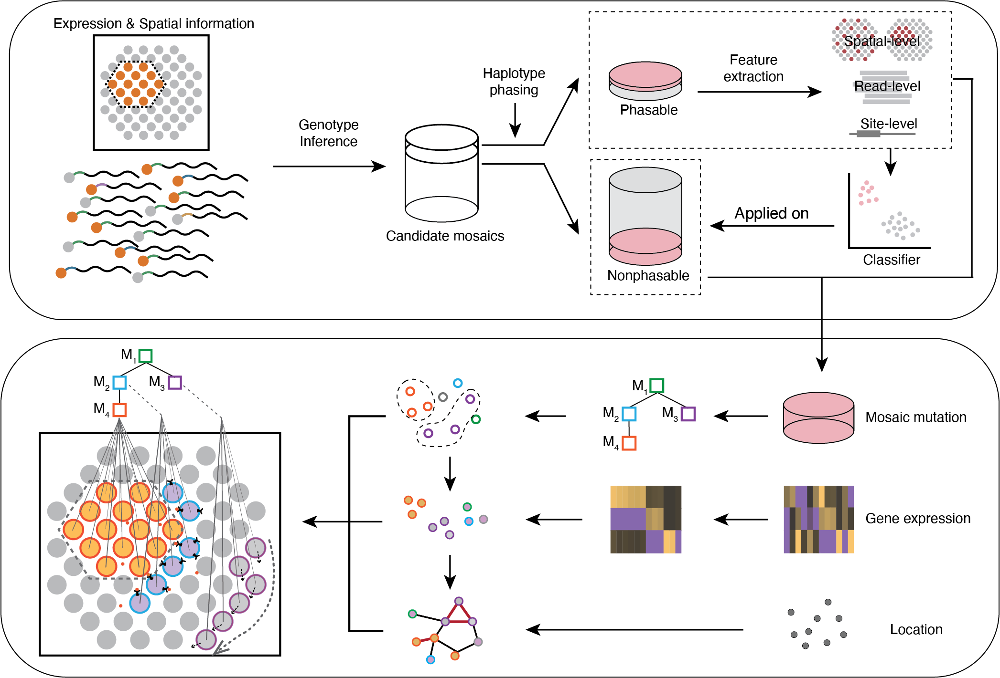

# SpaceTracer
SpaceTracer is an open-source algorithm capable of accurately detecting mosaic SNVs, including both nuclear SNVs and mitochondria SNVs, directly from spatial transcriptomics data. 



## Release Notes
- 2025/03/31: Version 1.0.0  
This is the initial version of SpaceTracer.


## Table Contents
- [Installation](#installation)
  - [Install from Github](#install-from-github)
  - [Dependencies](#dependencies)
- [Public Resources](#public-resources)
- [Run SpaceTracer with Snakemake](#run-spacetracer-with-snakemake)
- [Run SpaceTracer with Separate Steps](#run-spacetracer-with-separate-steps)
  - [Step0: Data Pre-processing](#step0-data-pre-processing)
  - [Step1: Quality Control](#step1-quality-control)
  - [Step2: Genotyping](#step2-genotyping)
  - [Step3: Feature Extraction](#step3-feature-extraction)
- [Contact](#contact)


## Installation
SpaceTracer requires Python version==3.9.0, samtools, bedtools and vcftools.

### Install from Github

```bash
git clone https://github.com/douymLab/SpaceTracer.git
```


### Dependencies
#### Docker image
We have created a docker image `spacetracer` with all dependencies installed and uploaded it to the [Docker Hub](https://hub.docker.com/r/xiayh17/spacetracer) so that you could use it directly as follows:

```bash
docker pull xiayh17/spacetracer
docker run -it -v $(pwd):/mnt/workflow xiayh17/spacetracer bash
```
Or you could also find the docker image file in https://figshare.com/s/c7836f53c4eafb556ee1, with name "spacetracer_latest.sif".

This code runs a Docker container interactively (`-it`), mounts the current working directory (`$(pwd)`) to the `/mnt/workflow` directory inside the container, and starts a bash shell.

Note: Docker must be installed on your machine. If you haven't installed Docker yet, follow the installation guide at: https://docs.docker.com/get-started/get-docker/.


#### Conda
Another way is to build your own [conda](https://docs.conda.io/en/latest/) environment using the `environment_new_version.yaml` we provided as follows:

```bash
conda env create -f environment.yaml
```
Then you could activate your environment with
```bash
conda activate SpaceTracer
```

This step may cost about 5 minutes in a Linux system.


#### Requirements
"All required dependencies are listed in the `environment.yaml` file. Alternatively, you can install the packages using pip if any issues arise."


## Public Resources

### Human reference genome
You can download the GRCh38 human reference genome from the [the National Center for Biotechnology Information (NCBI) GenBank](https://www.ncbi.nlm.nih.gov/datasets/taxonomy/9606/) using the following wget commands:

#### GRCh37/hg19:
```bash
wget ftp://ftp-trace.ncbi.nih.gov/1000genomes/ftp/technical/reference/phase2_reference_assembly_sequence/hs37d5.fa.gz   
wget ftp://ftp-trace.ncbi.nih.gov/1000genomes/ftp/technical/reference/phase2_reference_assembly_sequence/hs37d5.fa.gz.fai   
```
#### GRCh38/hg38:
```bash
wget ftp://ftp-trace.ncbi.nih.gov/1000genomes/ftp/technical/reference/GRCh38_reference_genome/GRCh38_full_analysis_set_plus_decoy_hla.fa 
wget ftp://ftp-trace.ncbi.nih.gov/1000genomes/ftp/technical/reference/GRCh38_reference_genome/GRCh38_full_analysis_set_plus_decoy_hla.fa.fai
```

### Human genome annotation
You can download the Gencode annotation files directly from the [Gencode website]((https://www.gencodegenes.org/human/#)).


### Mappability score
You could download the mappability score from the [UCSC Genome Browser](https://genome.ucsc.edu/) or use the following code:

#### Umap score (k=24, GRCh37/hg19):
```bash
wget https://bismap.hoffmanlab.org/raw/hg19.umap.tar.gz  
tar -zxvf hg19.umap.tar.gz  

```
#### Umap score (k=24, GRCh38/hg38):
```bash
wget https://bismap.hoffmanlab.org/raw/hg38.umap.tar.gz  
tar -zxvf hg38.umap.tar.gz  

```

### GTEx gene expression data
You could get the GTEx gene expression data from the [GTEx Portal](https://gtexportal.org/home/) or [dbGaP website](https://www.ncbi.nlm.nih.gov/gap/).


### Figshare
All necessary resources could be downloaded from https://figshare.com/s/c7836f53c4eafb556ee1.


## Run SpaceTracer with Snakemake
To run the algorithm, you use [Snakemake](https://snakemake.readthedocs.io/en/stable/) to execute the workflow. Follow these steps:

### Prerequisites
Install Snakemake using `conda` or `pip`:
```bash
# Using conda
conda install -c bioconda snakemake

# Using pip
pip install snakemake
```
### Running the workflow
```bash
# for conda environment: use run_snakemake_for_conda; for docker environment: use run_snakemake_for_docker
snakemake --configfile config.txt -s run_snakemake_for_conda
```
### Configuration
Ensure the `config.txt` file is correctly set up with the required input paths and parameters. 

| Parameter        | Description |
|------------------|-----------------------------------------------------------------------------|
| `sample`    | Sample name.    |
| `savePATH`    | Directory where the processed output files will be saved.    |
| `threads` | Number of threads to use for parallel processing. |
| `readLen` | Sequencing read length. |
| `spacerangerResult` | The directory of storing spaceranger results. |
| `srcPath`    | SpaceTracer repository directory.    |
| `GENOME_FA`    | Reference genome directory.    |
| `gff3_file` | Human genome annotation, formatted in GFF3 (General Feature Format version 3). |
| `mappbablity_file` | Mappability data file in BEDGraph. |
| `prior_file`     | Population allele frequency file.|
| `genomad_file`     | gnomAD annotation file.|
| `SPECIES` | Sample species. |
| `gender`   | choices=["F","M","female","male"]. Sample gender. |
| `gtexGene` | The gtexGene file from the GTEx project that contains gene expression data. |
| `lysis_error_SigProfile` | Lysis error signature file. |
| `PCR_errors_SigProfile` | PCR error signature file. |
| `bkg` | Background error file. |
| `cluster` | Optional. Spots cluster file. |
| `h5ad_file` | Optional. Spatial transcriptomics data information file in h5ad format. |

### Results
The final somatic mutation list detected would be saved in the `$savePATH/$sample/predict/results/demo_total_pred_truesites.txt` file.

## Run SpaceTracer with Separate Steps

### Step0: Data Pre-processing
In this step, we perform pre-processing on raw data obtained from public datasets or sequencing platforms. These are just suggestions for data preparation. If you already have the required data formatted for Step 1, you can skip this step and proceed directly to Steps 1-4.

#### Step0.1: Filter bam file
Example demo
```bash
# create output directory
mkdir -p demo_output/demo/bam_filter/
# filter bam file (1. reads not in tissue; 2. reads with low Mapping Quality; 3. reads with high mismatches)
sed 's/,/\t/g' demo_input/Spaceranger_result/outs/spatial/tissue_positions.csv | sed '1d' | awk '{if ($2==0) print $1, "OUT"; else print $1, "IN"}' OFS="\t" >demo_output/demo/bam_filter/demo_barcode.txt;sinto filterbarcodes -b demo_input/Spaceranger_result/outs/possorted_genome_bam.bam -c demo_output/demo/bam_filter/demo_barcode.txt --barcodetag "CB" --outdir demo_output/demo/bam_filter -p 4; samtools view -e "[nM] <= 5" -q 255 -o demo_output/demo/bam_filter/IN_filter.bam demo_output/demo/bam_filter/IN.bam;samtools index demo_output/demo/bam_filter/IN.bam; samtools index demo_output/demo/bam_filter/IN_filter.bam
```

#### Step0.2: mpile-up to get the candidate mutation list
Example demo
```bash
# mpile-up (please offer the absolute path of ${genome.fa} )
samtools mpileup demo_output/demo/bam_filter/IN_filter.bam -s -B -Q 0 -q 0 -d 200000 -f ${genome.fa} | java -classpath others/java_mpileup/ PileupFilter --minbasequal=20 --minmapqual=20 --asciibase=33 --filtered=1| awk '$3!="N"' |cut -f 1-3,8-15 >demo_output/demo/mpileup.result

# filter mpile-up results to get initial candidate sites
awk '$6+$7+$9+$10 >= 5 && $4+$5+$6+$7+$9+$10>=30' demo_output/demo/mpileup.result |awk ' ($6+$7+$9+$10)/($4+$5+$6+$7+$9+$10)>=0.001' - > demo_output/demo/mpileup.filter.result
```

#### Step0.3: Get population allele frequency
Example demo
```bash
# the ${annovar_info.txt} was a file containing the gnomad files, which seperated by chromosome. And these files are accessable in https://figshare.com/s/c7836f53c4eafb556ee1, with 
python 0_other_func.py prior \
  --outprefix demo \
  --posfile demo_output/mpileup.filter.result  \
  --annovar ${annovar_info.txt} \
  --thread 2 \
  --outdir demo_output/demo
```

#### Step0.4: Calculate cell number for each spot
Example demo
```bash
python others/get_umiCount_cellNum.py \
  --bam demo_output/demo/bam_filter/IN_filter.bam \
  --run \
  --cluster demo_input/demo_cluster.txt \
  --outdir demo_output/demo
```


#### Step0.5: Cluster spots
Example demo
```bash
python 0_other_func.py cluster \
  --indir demo_input/Spaceranger_result/outs \
  --method SpaGCN \
  --ncluster 6 \
  --sample demo \
  --outdir demo_input/Spaceranger_result/outs
```


### Step1: Quality Control
This step calculates the read count for each allele at each site after doing the quality, background error and allele frequency test.

```bash
python 1_run_data_process.py \
  --posfile <POSFILE> \
  --bam <BAMFILE> \
  --outdir <OUTPUTDIRECTORY> \
  --outprefix <OUTPREFIX> \
  --barcodes <BARCODESFILE> \
  --cellcluster <CELLCLUSTERFILE> \
  --thread <NUM_THREADS> 
```

#### Input parameters

| Parameter        | Description |
|------------------|-----------------------------------------------------------------------------|
| `--posfile`      | Position file. |
| `--bam`          | BAM file|
| `--outdir`       | Directory where the processed output files will be saved.                   |
| `--outprefix`    | Optional (default="sample"). Prefix for the output files. The results will be saved with this prefix.    |
| `--barcodes`     | Spots spatial location file.|
| `--cellcluster`  | Spots cluster file.|
| `--cellpos`  | Optional (required when running Stereo-seq). Spot barcode and name corresponding file.|
| `--platform`  | Optional (choices=["visium","stereo","ST"], default="visium"). Spot barcode and name corresponding file.|
| `--thread` | Optional (default=2). Number of threads to use for parallel processing. |
| `--epsQ` | Optional (default=20). Threshold for consensus read quality filtering. |
| `--alpha` | Optional (default=0.05). Confidence level. |
| `--epsAF` | Optional (default=0.01). Threshold for alternative allele frequency (background error rate) test. |


#### Example demo

```bash
python 1_run_data_process.py  \
  --posfile demo_output/demo/mpileup.filter.result \
  --outprefix demo \
  --bam demo_output/demo/bam_filter/IN_filter.bam \
  --barcodes  demo_input/Spaceranger_result/outs/spatial/tissue_positions.csv \
  --outdir demo_output/demo/counts_files \
  --thread 2 \
  --cellcluster demo_input/demo_cluster.txt
```
This step may cost around 2 seconds if running on the demo data.

#### Example output
- `demo/output/count_files/demo.spot_count.out`
- `demo/output/count_files/demo.cluster_filter.count.out`
- `demo/output/count_files/demo.cluster.count.out`
- `demo/output/count_files/demo.ind_filter.count.out`


### Step2: Genotyping
This step calculates the genotype at the spot, cluster and individual level respectively.

```bash
python 2_run_genotyper.py \
  --spot_count <SPOTCOUNTFILE> \
  --cluster_count <CLUSTERCOUNTFILE> \
  --ind_count <INTCOUNTFILE> \
  --cluster <CLUSTERFILE> \
  --outdir <OUTPUTDIRECTORY> \
  --outprefix <OUTPREFIX> \
  --prior <PRIORFILE> \
  --cellnum_file <CELLNUMFILE> 
```


#### Input parameters

| Parameter        | Description |
|------------------|-----------------------------------------------------------------------------|
| `--spot_count`      | Spot allele count file. |
| `--cluster_count`   | Cluster level allele count file. |
| `--ind_count`   | Individual level allele count file. |
| `--cluster`  | Spots cluster file.|
| `--outdir`       | Directory where the processed output files will be saved.                   |
| `--outprefix`    | Optional (default="sample"). Prefix for the output files. The results will be saved with this prefix.    |
| `--prior`     | Optional. Population allele frequency file.|
| `--cellnum_file`  | Optional. Spots estimated cell number file.|
| `--cell_num` | Optional (default=20). The estimated cell numbers per spot. If not given cellnum_file. |
| `--epsQ` | Optional (default=20). Threshold for consensus read quality filtering. |
| `--alpha` | Optional (default=0.05). Confidence level. |
| `--epsAF` | Optional (default=0.01). Threshold for alternative allele frequency (background error rate) test. |
| `--mu` | Optional (default=1e-7). The population mutation rate prior. |
| `--max_dp` | Optional (default=1000). The max threshold for the read depth, if depth larger than the threshold, the allele numbers would be downsampled. |
| `--vaf` | Optional (default=1e-5). Avoid 0 allele frequency. |
| `--min_dp` | Optional (default=30). The min threshold for the read depth, if depth smaller than the threshold, the allele would be removed in following analysis. |
| `--max_vaf` | Optional (default=0.3). The max threshold for the vaf, if vaf hihgher than the threshold, the allele would be removed in the following analysis. |
| `--min_vaf` | Optional (default=1e-5). The min threshold for the vaf, to avoid 0 allele frequency. |


#### Example demo

```bash
python 2_run_genotyper.py \
  --spot_count demo_output/demo/counts_files/demo.spot.count.out \
  --cluster_count demo_output/demo/counts_files/demo.cluster.count.out \
  --ind_count demo_output/demo/counts_files/demo.ind_filter.count.out \
  --cluster demo_input/demo_cluster.txt \
  --outprefix demo \
  --prior demo_input/demo.prior.out \
  --cellnum_file demo_input/refined_umi_read_cellNum.txt  \
  --outdir demo_output/demo/geno_files
```
This step may cost around 4 seconds if running on the demo data.

#### Example output

- `demo/output/geno_files/demo.germ_genotype.out`
- `demo/output/geno_files/demo.ind_genotype.out`
- `demo/output/geno_files/demo.ind_genotype_filter.out`
- `demo/output/geno_files/demo.cluster_vaf.out`
- `demo/output/geno_files/demo.spot_genotype.out`


### Step3: Feature Extraction
This step extract the spatial-level, read-level and site-level features for each site.

```bash
python 3_run_get_features.py \
  --fasta <FASTAFILE> \
  --raw_bam <RAWBAMFILE> \
  --filter_bam <FILTERBAMFILE> \
  --gender <GENDER> \
  --outdir <OUTPUTDIRECTORY> \
  --outprefix <OUTPREFIX> \
  --thread <NUM_THREADS> \
  --germline <GERMLINEFILE> \
  --ind_genotype <INDGENOFILE> \
  --spot_genotype <SPOTGENOFILE> \
  --barcodes <BARCODESFILE> \
  --species <SPECIES> \
  --readLen <READLENGTH> \
  --prior <PRIORFILE> \
  --h5ad <H5ADFILE>  \
  --spaceranger_result_dir <SPACERANGERDIRECTORY \
  --ind_count_file <INDCOUNTFILE> \
  --mappbablity_file <MAPPABILITYFILE> \
  --gff3_file <GFF3FILE> \
  --vaf_cluster_file <CLUSTERVAFFILE> \
  --gtexGene <GTEXTFILE> \
  --artifact_signature1 <LYSISERRORSIGFILE> \
  --artifact_signature2 <PCRERRORSIGFILE> \
  --bkg <BKGFILE>
``` 


#### Input parameters

| Parameter        | Description |
|------------------|-----------------------------------------------------------------------------|
| `--fasta`      | Fasta file. |
| `--raw_bam`   | Bam file. |
| `--filter_bam`   | Bam file after mismatch and mapping quality filtering. |
| `--gender`   | choices=["F","M","female","male"]. Gender. |
| `--outdir`       | Directory where the processed output files will be saved.                   |
| `--outprefix`    | Optional (default="sample"). Prefix for the output files. The results will be saved with this prefix.    |
| `--thread` | Optional (default=2). Number of threads to use for parallel processing. |
| `--germline`     | Germline file.|
| `--ind_genotype`  | Individual genotype file.|
| `--spot_genotype` | Spot genotype file. |
| `--barcodes`     | Spots spatial location file.|
| `--species` | Optional (default="human"). Sample species. |
| `--readLen` | Optional (default=150). Sequencing read length. |
| `--prior`     | Optional. Population allele frequency file.|
| `--h5ad` | Optional. Data information file in h5ad format. |
| `--spaceranger_result_dir` | Optional. The directory of storing spaceranger results. |
| `--ind_count_file` | Optional. Individual allele counts file. |
| `--mappbablity_file` | Optional. Mappability file. |
| `--gff3_file` | Optional. Gff3 file. |
| `--vaf_cluster_file` | Optional. File contains the alternative allele frequency (vaf) for each cluster. |
| `--gtexGene` | Optional. gtexGene file. |
| `--artifact_signature1` | Optional. Lysis error signature file. |
| `--artifact_signature2` | Optional. PCR error signature file. |
| `--bkg` | Optional. Background error file. |


#### Example demo

```bash
python 3_run_get_features.py \
  --fasta /storage/douyanmeiLab/yangzhirui/Reference/Cellranger/refdata-gex-GRCh38-2020-A/fasta/genome.fa \
  --raw_bam demo_output/demo/bam_filter/IN.bam \
  --filter_bam demo_output/demo/bam_filter/IN_filter.bam \
  --gender male \
  --outdir demo_output/demo/features_dir \
  --outprefix demo \
  --thread 2 \
  --germline demo_output/demo/geno_files/demo.germ_genotype.out \
  --ind_genotype demo_output/demo/geno_files/demo.ind_genotype_filter.out \
  --spot_genotype demo_output/demo/geno_files/demo.spot_genotype.out \
  --readLen 120 \
  --prior demo_input/demo.prior.out \
  --h5ad demo_input/demo_results.h5ad  \
  --spaceranger_result_dir demo_input/Spaceranger_result/outs/ \
  --ind_count_file demo_output/demo/counts_files/demo.ind_filter.count.out \
  --mappbablity_file demo_input/Resource/demo.k24.umap.bedgraph \
  --gff3_file demo_input/Resource/demo.gencode.v44.annotation.exon.sort.gff3 \
  --vaf_cluster_file demo_output/demo/geno_files/demo.cluster_vaf.out \
  --gtexGene demo_input/Resource/demo.gtexGene.txt \
  --artifact_signature1 demo_input/Resource/lysis_error_SigProfile.txt \
   --artifact_signature2 demo_input/Resource/PCR_errors_SigProfile.txt \
   --bkg demo_input/demo_bkg.txt \
   --barcodes demo_input/Spaceranger_result/outs/spatial/tissue_positions.csv
```
This step may cost around 42 seconds if running on the demo data.

#### Example output

- `demo/output/features_dir/demo.spatial_feature.txt`
- `demo/output/features_dir/demo.phase_beforeUMIcombination.txt`
- `demo/output/features_dir/demo.phase_afterUMIcombination.txt`
- `demo/output/features_dir/demo.features.txt`
- `demo/output/features_dir/demo.features.add_hFDR.txt`


### Step4: Mutation Prediction
This step using random forest models to call the somatic mutations from the candidate list.

```bash
python 4_run_model_predict.py \
  --input <INPUT> \
  --outdir <OUTPUTDIRECTORY> \
  --outprefix <OUTPREFIX> \
  --model_dir <MODELDIRECTORY> \
  --model_name <MODELNAME> \
  --random_seed <RANDOMSEED> \
  --train <TRAIN> \
  --true_sites <TRUESITES> \
  --artifact_sites <ARTIFACTSITES> \
  --thr_altcount <THRALTCOUNT> \
  --thr_altSpotNum <THRALTSPOTNUMBER> \
  --subset <SUBSET> \
  --drop_subset <DROPSUBSET> \
  --hard_filter <HARDFILTER> \
  --phase_refine <PHASEREFINE> \
  --save <SAVE> \
  --plot <PLOT> \
  --n_features <FEATURENUMBER> \
  --tune <TUNE> \
  --k_neighbors <KNEIGHBORS>
```

#### Input parameters

| Parameter        | Description |
|------------------|-----------------------------------------------------------------------------|
| `--input`      | Input features file. |
| `--outdir`       | Directory where the processed output files will be saved.                   |
| `--outprefix`    | Optional (default="sample"). Prefix for the output files. The results will be saved with this prefix.    |
| `--model_dir` | Optional (default="./models_trained/tumor_skin_model"). The directory of the trained models. |
| `--model_name`     | Optional (default="tumor_skin_model"). The sample name of the trained models.|
| `--random_seed` | Optional (default=100). Random seed. |
| `--train` | Optional (default=FALSE, choices=[True, False]). Boolean variable for whether training the models or not. |
| `--true_sites`     | Optional (default=[]). The manually checked true somatic mutation list (a text file or a list).|
| `--artifact_sites` | Optional (default=[]). The list of artifact sites (a text file or a list). |
| `--thr_altcount` | Optional (default=5). The threshold of the alternative alleles per site. |
| `--thr_altSpotNum` | Optional. The threshold of the number of spots contains the alternative alleles, only use when we want to predict for the spot-specific mutations. |
| `--subset` | Optional. The features used to classificate the true somatic mutations, use all features if 'None'. |
| `--drop_subset` | Optional. The features do not want to be used to classificate the true somatic mutations. |
| `--hard_filter` | Optional (choices=[True, False], default=True). Boolean variable of whether performing the hard filters on the predicted sites. |
| `--phase_refine` | Optional (choices=[True, False], default=True). Boolean variable for whether use the phasing refinement model. |
| `--save` | Optional (choices=[True, False], default=True). Boolean variable for whether saving the models, only valid when train=TRUE. |
| `--plot` (`-p`) | Optional (choices=[True, False], default=True). Boolean variable for plotting the feature importances and the PCA figures. |
| `--n_features` | Optional (default=20). The number of the most-important features from the random forest model used in the PCA projection. |
| `--tune` | Optional (choices=['Bayesian_opt', 'random_search', 'grid_search', None], default='random_search'). The method for tuning the hyperparameters used in the random forest. |
| `--k_neighbors` | Optional (default=4). The nearest neighbors used to define the neighborhood of samples in SMOTE. |


#### Example demo

```bash
python 4_run_model_predict.py \
  --input demo_output/demo/features_dir/demo.features.add_hFDR.txt \
  --outdir demo_output/demo/predict \
  --outprefix demo \
  --train FALSE \
  --thr_altcount 5 \
  --phase_refine FALSE \
  --save FALSE
```
This step may cost around 12 seconds if running on the demo data.

#### Example output

- `demo/output/predict/results/demo_phased_pred_truesites_filter.txt`
- `demo/output/predict/results/demo_phased_pred_truesites.txt`
- `demo/output/predict/results/demo_pred_truesites_filter.txt`
- `demo/output/predict/results/demo_pred_truesites.txt`
- `demo/output/predict/results/demo_total_pred_truesites.txt`

The final somatic mutation list detected would be saved in the `demo/output/predict/results/demo_total_pred_truesites.txt` file.


## Contact:
If you have any questions please contact us:  
Zhirui Yang: yangzhirui@westlake.edu.cn  
Mengdie Yao: yaomengdie@westlake.edu.cn  
Yanmei Dou: douyanmei@westlake.edu.cn


